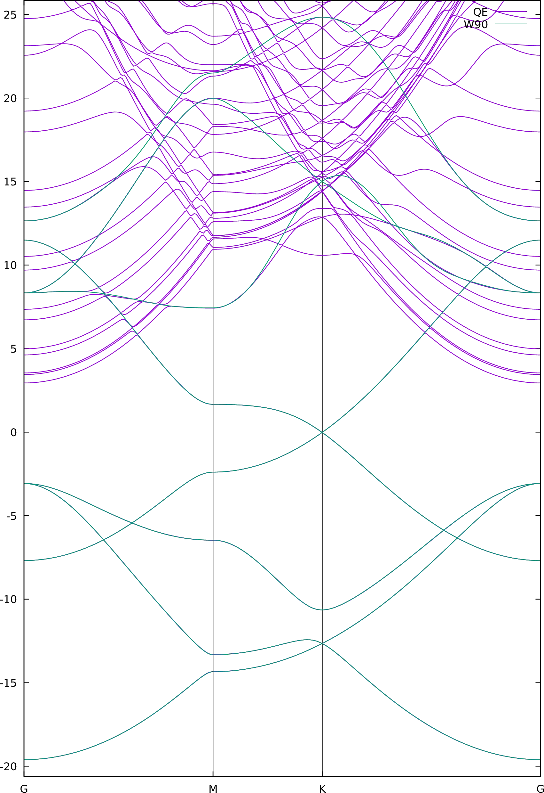

# 1: Graphene — Projectability-disentangled Wannier functions

## Outline

Obtain MLWFs for graphene using projectability disentanglement. For more details
on the methodology, see Ref.[@Qiao2023-pdwf].

## Input files

- Directory: `ex1/`

- `graphene.scf` The `pw.x` input file for ground state calculation

    ??? quote "graphene.scf"

        ```fortran linenums="1" title="Input file"
        --8<-- "wannier-tutorials/2024_06_EPW_Austin/Sat.3.Qiao/ex1/graphene.scf"
        ```

- `graphene.bands` The `pw.x` input file for band structure calculation

    ??? quote "graphene.bands"

        ```fortran linenums="1" title="Input file"
        --8<-- "wannier-tutorials/2024_06_EPW_Austin/Sat.3.Qiao/ex1/graphene.bands::48"
        ...
        ...
        ```

- `graphene.bandsx` The `bands.x` input file for extracting band structure
    eigenvalues

    ??? quote "graphene.bandsx"

        ```fortran linenums="1" title="Input file"
        --8<-- "wannier-tutorials/2024_06_EPW_Austin/Sat.3.Qiao/ex1/graphene.bandsx"
        ```

- `graphene.projwfc` The `projwfc.x` input file for projectability calculation

    ??? quote "graphene.projwfc"

        ```fortran linenums="1" title="Input file"
        --8<-- "wannier-tutorials/2024_06_EPW_Austin/Sat.3.Qiao/ex1/graphene.projwfc"
        ```

- `graphene.plotband` The `plotband.x` input file for plotting
    band structure

    ??? quote "graphene.plotband"

        ```fortran linenums="1" title="Input file"
        --8<-- "wannier-tutorials/2024_06_EPW_Austin/Sat.3.Qiao/ex1/graphene.plotband"
        ```

- `graphene.nscf` The `pw.x` input file to obtain Bloch states on a
    uniform grid

    ??? quote "graphene.nscf"

        ```fortran linenums="1" title="Input file"
        --8<-- "wannier-tutorials/2024_06_EPW_Austin/Sat.3.Qiao/ex1/graphene.nscf::48"
        ...
        ...
        ```

- `graphene.pw2wan` Input file for `pw2wannier90.x`

    ??? quote "graphene.pw2wan"

        ```fortran linenums="1" title="Input file"
        --8<-- "wannier-tutorials/2024_06_EPW_Austin/Sat.3.Qiao/ex1/graphene.pw2wan"
        ```

- `graphene.win` The `wannier90.x` input file

    ??? quote "graphene.win"

        ```fortran linenums="1" title="Input file"
        --8<-- "wannier-tutorials/2024_06_EPW_Austin/Sat.3.Qiao/ex1/graphene.win::55"
        ...
        ...
        ```

- `graphene_bandsdiff.gnu` The gnuplot script to compare DFT and Wannier bands

    ??? quote "graphene_bandsdiff.gnu"

        ```gnuplot linenums="1" title="Gnuplot script"
        --8<-- "wannier-tutorials/2024_06_EPW_Austin/Sat.3.Qiao/ex1/graphene_bandsdiff.gnu"
        ```

## Steps

1. Run `pw.x` to obtain the ground state of graphene

    ```bash title="Terminal"
    pw.x < graphene.scf > scf.out
    ```

2. Run `pw.x` to obtain the band structure of graphene

    ```bash title="Terminal"
    pw.x < graphene.bands > bands.out
    ```

3. Run `projwfc.x` to obtain the band structure projectability of graphene

    ```bash title="Terminal"
    projwfc.x < graphene.projwfc > projwfc.out
    ```

4. Run `bands.x` to obtain a `graphene.bands.dat` file containing the
    band structure of graphene

    ```bash title="Terminal"
    bands.x < graphene.bandsx > bandsx.out
    ```

5. Run `plotband.x` to plot the band structure with projectability for
    graphene

    !!! note

        Run `plotband.x` interactively to see the meaning of each line in the
        input file.

    1. First rename file so that it can be recognized by `plotband.x`

        ```bash title="Terminal"
        mv graphene.bands.dat.proj.projwfc_up graphene.bands.dat.proj
        ```

    2. Run `plotband.x`

        ```bash title="Terminal"
        plotband.x < graphene.plotband > plotband.out
        ```

    3. Generate a `graphene.projbands.gnu_projected.ps` file

        ```bash title="Terminal"
        gnuplot graphene.projbands.gnu
        ```

    4. Generate a `graphene.projbands.gnu_projected.pdf` file, see the following
        Fig. [Projected bands](#fig:graphene_projbands)

        ```bash title="Terminal"
        ps2pdf graphene.projbands.gnu_projected.ps
        ```

        <figure markdown="span" id="fig:graphene_projbands">
        {width="500"}
        <figcaption markdown="span">Band structure of graphene with projectability.
        </figcaption>
        </figure>

6. Run `pw.x` to obtain the Bloch states on a uniform k-point grid

    ```bash title="Terminal"
    pw.x < graphene.nscf > nscf.out
    ```

7. Run `pw.x` to generate a list of the required overlaps (written into the
    `graphene.nnkp` file).

    !!! note

        See `win` input file, no need to specify initial projections,
        they are automatically chosen from the pseudo-atomic orbitals inside
        pseudopotentials used in the scf calculation.

    ```bash title="Terminal"
    wannier90.x -pp graphene
    ```

8. Run `pw2wannier90.x` to compute the overlap between Bloch states and
    the projections for the starting guess (written in the
    `graphene.mmn` and `graphene.amn` files).

    ```bash title="Terminal"
    pw2wannier90.x < graphene.pw2wan > pw2wan.out
    ```

9. Run  to compute the MLWFs.

    ```bash title="Terminal"
    wannier90.x graphene
    ```

10. Run `gnuplot` to compare DFT and Wannier-interpolated bands, this
    will generate a PDF file `graphene_bandsdiff.pdf`, see the following
    Fig. [Bands comparison](#fig:graphene_bandsdiff).

    ```bash title="Terminal"
    ./graphene_bandsdiff.gnu
    ```

    Notice that high-projectability states in the conduction region are
    properly reproduced. Try commenting out the
    `dis_froz_proj, dis_proj_max/min` lines in the `win` input file, and
    use the energy disentanglement `dis_froz_max/min`, and compare the
    band interpolations.

    <figure markdown="span" id="fig:graphene_bandsdiff">
    {width="500"}
    <figcaption markdown="span">Comparison of DFT and Wannier bands.
    </figcaption>
    </figure>

11. (Optional) Clean up all output files

    ```bash title="Terminal"
    make clean
    ```
