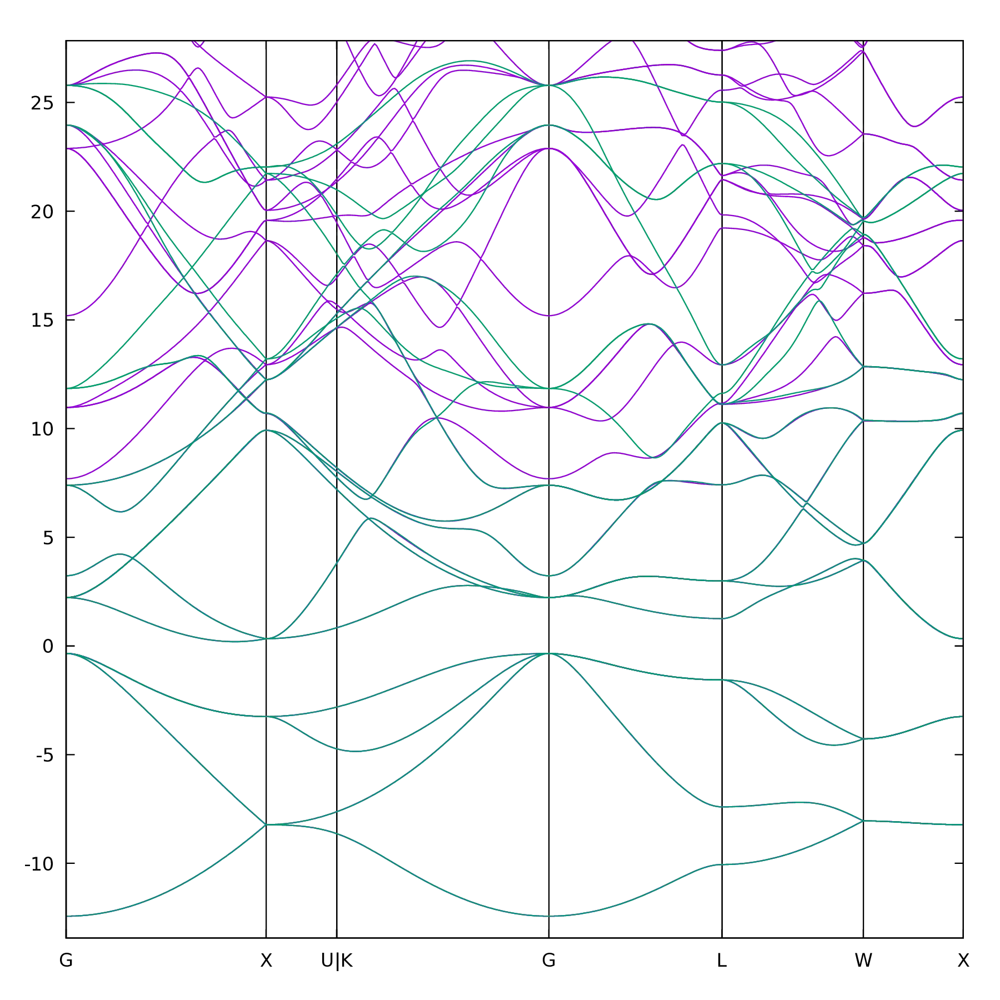

# 2: Silicon — Projectability-disentangled Wannier functions with custom projectors

## Outline

Obtain MLWFs for silicon using projectability disentanglement, with additional
$3d$ projectors to describe high-energy conduction bands. For more details on
the methodology, see Ref.[@Qiao2023-pdwf].

## Input files

- Directory: `Sat/ex2/`

- `silicon.scf` The `pw.x` input file for ground state calculation

    ??? quote "silicon.scf"

        ```fortran title="Input file"
        --8<-- "wannier-tutorials/2024_06_EPW_Austin/Qiao/ex2/silicon.scf"
        ```

- `silicon.bands` The `pw.x` input file for band structure calculation

    ??? quote "silicon.bands"

        ```fortran title="Input file"
        --8<-- "wannier-tutorials/2024_06_EPW_Austin/Qiao/ex2/silicon.bands"
        ```

- `silicon.nscf` The `pw.x` input file to obtain Bloch states on a uniform grid

    ??? quote "silicon.nscf"

        ```fortran title="Input file"
        --8<-- "wannier-tutorials/2024_06_EPW_Austin/Qiao/ex2/silicon.nscf"
        ```

- `silicon.pw2wan` Input file for `pw2wannier90.x`

    ??? quote "silicon.pw2wan"

        ```fortran title="Input file"
        --8<-- "wannier-tutorials/2024_06_EPW_Austin/Qiao/ex2/silicon.pw2wan"
        ```

- `silicon.win` The `wannier90.x` input file

    ??? quote "silicon.win"

        ```fortran title="Input file"
        --8<-- "wannier-tutorials/2024_06_EPW_Austin/Qiao/ex2/silicon.win"
        ```

## Steps

1. Run `pw.x` to obtain the ground state of silicon

    ```bash title="Terminal"
    pw.x < silicon.scf > scf.out
    ```

2. Run `pw.x` to obtain the band structure of silicon

    ```bash title="Terminal"
    pw.x < silicon.bands > bands.out
    ```

3. Run `bands.x` to obtain a `silicon.bands.dat` file containing the band
    structure of silicon

    ```bash title="Terminal"
    bands.x < silicon.bandsx > bandsx.out
    ```

4. Run `pw.x` to obtain the Bloch states on a uniform k-point grid

    ```bash title="Terminal"
    pw.x < silicon.nscf > nscf.out
    ```

5. Run `pw.x` to generate a list of the required overlaps (written into the
    `silicon.nnkp` file).

    !!! note

        See `win` input file, no need to specify initial projections,
        they are chosen from the pseudo-atomic orbitals inside the
        `ext_proj/Si.dat` file.

    ```bash title="Terminal"
    wannier90.x -pp silicon
    ```

6. Run `pw2wannier90.x` to compute the overlap between Bloch states and
    the projections for the starting guess (written in the `silicon.mmn`
    and `silicon.amn` files).

    ```bash title="Terminal"
    pw2wannier90.x < silicon.pw2wan > pw2wan.out
    ```

7. Run `pw.x` to compute the MLWFs.

    ```bash title="Terminal"
    wannier90.x silicon
    ```

8. Run `gnuplot` to compare DFT and Wannier-interpolated bands, this
    will generate a PDF file `silicon_bandsdiff.pdf`, see
    Fig.[Bands comparison](#fig:silicon_bandsdiff).

    ```bash title="Terminal"
    ./silicon_bandsdiff.gnu
    ```

    <figure markdown="span" id="fig:silicon_bandsdiff">
    {width="500"}
    <figcaption markdown="span">Comparison of DFT and Wannier bands for silicon.
    </figcaption>
    </figure>

9. (Optional) Clean up all output files

    ```bash title="Terminal"
    make clean
    ```

## Further ideas

1. Try changing the `atom_proj_exclude` in `silicon.pw2wan` file, i.e.,
    these commented lines

    ```fortran title="Input file" hl_lines="5"
    ! for excluding specific projectors
    ! this excludes 3d projectors, then the results are similar
    ! to that of using UPF file, i.e., project onto Si s+p orbitals
    ! for the indices of orbitals, see the pw2wan stdout
    ! atom_proj_exclude = 5 6 7 8 9 14 15 16 17 18
    ```

2. Now that $3d$ projectors provide us a larger space for optimization,
    you can try increasing the `dis_froz_max` to freeze higher energy
    bands, if you are targeting at reproducing those eigenvalues.

    Note that the `dis_proj_min/max` and `dis_froz_min/max` can be
    enabled simultaneously: the union of inner energy window and
    high-projectability states will be freezed, and the union of states
    outside outer energy window and having low projectability will be
    discared. Thus, you can still use energy window to make sure
    near-Fermi energy states are well reproduced, and use
    "projectability window" to selectively freeze atomic-like states in
    the conduction region.

3. The default `dis_proj_max = 0.95` might not freeze all the states
    you want, try changing this value and see the band interpolation
    results. For other materials, it might worth trying decreasing this
    value to freeze more states.
