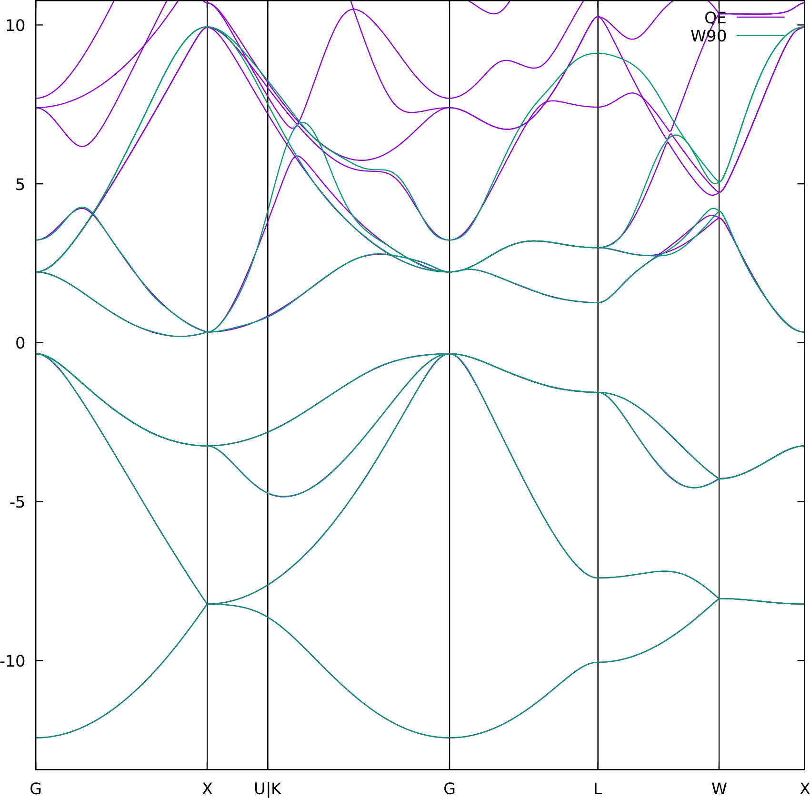
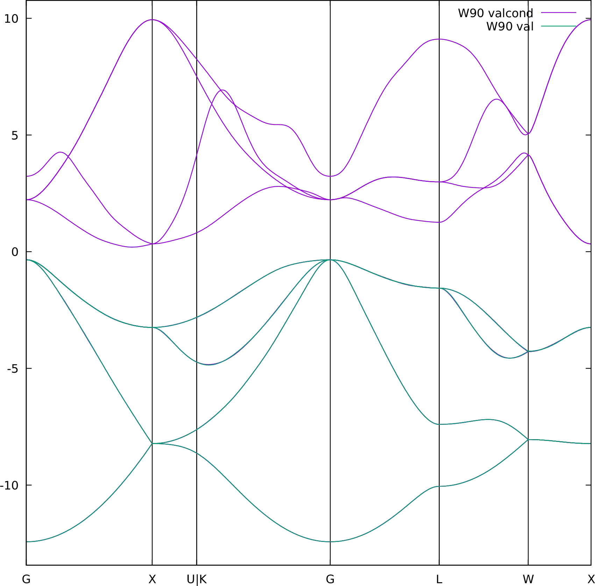
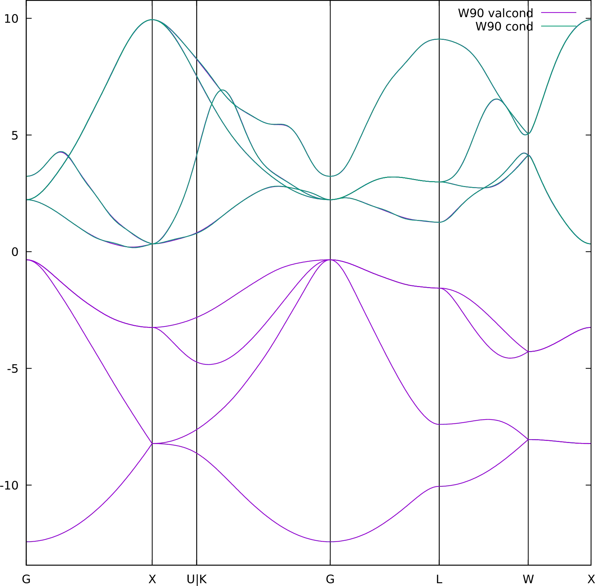

# 3: Silicon — Manifold-remixed Wannier functions

## Outline

Separate silicon valence and conduction bands, using manifold-remixed Wannier
functions (MRWF). For more details on the methodology, see Ref.[@Qiao2023-mrwf].

## Input files

- Directory: `ex3/`

- `silicon.scf` The `pw.x` input file for ground state calculation

    ??? quote "silicon.scf"

        ```fortran linenums="1" title="Input file"
        --8<-- "wannier-tutorials/2024_06_EPW_Austin/Sat.3.Qiao/ex3/silicon.scf"
        ```

- `silicon.bands` The `pw.x` input file for band structure calculation

    ??? quote "silicon.bands"

        ```fortran linenums="1" title="Input file"
        --8<-- "wannier-tutorials/2024_06_EPW_Austin/Sat.3.Qiao/ex3/silicon.bands::45"
        ...
        ...
        ```

- `silicon.nscf` The `pw.x` input file to obtain Bloch states on a uniform grid

    ??? quote "silicon.nscf"

        ```fortran linenums="1" title="Input file"
        --8<-- "wannier-tutorials/2024_06_EPW_Austin/Sat.3.Qiao/ex3/silicon.nscf::45"
        ...
        ...
        ```

- `silicon.pw2wan` Input file for `pw2wannier90.x`

    ??? quote "silicon.pw2wan"

        ```fortran linenums="1" title="Input file"
        --8<-- "wannier-tutorials/2024_06_EPW_Austin/Sat.3.Qiao/ex3/silicon.pw2wan"
        ```

- `silicon.win` The `wannier90.x` input file

    ??? quote "silicon.win"

        ```fortran linenums="1" title="Input file"
        --8<-- "wannier-tutorials/2024_06_EPW_Austin/Sat.3.Qiao/ex3/silicon.win::55"
        ...
        ...
        ```

- `mrwf.jl` The julia code to obtain MRWFs for valence and conduction bands

    ??? quote "mrwf.jl"

        ```julia linenums="1" title="Julia script"
        --8<-- "wannier-tutorials/2024_06_EPW_Austin/Sat.3.Qiao/ex3/mrwf.jl"
        ```

- `silicon_bandsdiff.gnu` The gnuplot script to compare DFT and Wannier bands

    ??? quote "silicon_bandsdiff.gnu"

        ```gnuplot linenums="1" title="Gnuplot script"
        --8<-- "wannier-tutorials/2024_06_EPW_Austin/Sat.3.Qiao/ex3/silicon_bandsdiff.gnu"
        ```

- `silicon_bandsdiff_val.gnu` The gnuplot script to compare Wannier bands for
    valence+conduction and valence.

    ??? quote "silicon_bandsdiff_val.gnu"

        ```gnuplot linenums="1" title="Gnuplot script"
        --8<-- "wannier-tutorials/2024_06_EPW_Austin/Sat.3.Qiao/ex3/silicon_bandsdiff_val.gnu"
        ```

- `silicon_bandsdiff_cond.gnu` The gnuplot script to compare Wannier bands for
    valence+conduction and conduction.

    ??? quote "silicon_bandsdiff_cond.gnu"

        ```gnuplot linenums="1" title="Gnuplot script"
        --8<-- "wannier-tutorials/2024_06_EPW_Austin/Sat.3.Qiao/ex3/silicon_bandsdiff_cond.gnu"
        ```

## Steps

1. Run `pw.x` to obtain the ground state of silicon

    ```bash title="Terminal"
    pw.x < silicon.scf > scf.out
    ```

2. Run `pw.x` to obtain the band structure of silicon

    ```bash title="Terminal"
    pw.x < silicon.bands > bands.out
    ```

3. Run `bands.x` to obtain a `silicon.bands.dat` file containing the band
    structure of silicon

    ```bash title="Terminal"
    bands.x < silicon.bandsx > bandsx.out
    ```

4. Run `pw.x` to obtain the Bloch states on a uniform k-point grid

    ```bash title="Terminal"
    pw.x < silicon.nscf > nscf.out
    ```

5. Run `pw.x` to generate a list of the required overlaps (written into the
    `silicon.nnkp` file).

    ```bash title="Terminal"
    wannier90.x -pp silicon
    ```

6. Run `pw2wannier90.x` to compute the overlap between Bloch states and
    the projections for the starting guess (written in the `silicon.mmn`
    and `silicon.amn` files).

    ```bash title="Terminal"
    pw2wannier90.x < silicon.pw2wan > pw2wan.out
    ```

7. Run `pw.x` to compute the MLWFs.

    ```bash title="Terminal"
    wannier90.x silicon
    ```

8. Run `gnuplot` to compare DFT and Wannier-interpolated bands, this
    will generate a PDF file `silicon_bandsdiff.pdf`, see
    Fig.[Bands comparison](#fig:silicon_bandsdiff).

    ```bash title="Terminal"
    ./silicon_bandsdiff.gnu
    ```

    <figure markdown="span" id="fig:silicon_bandsdiff">
    {width="500"}
    <figcaption markdown="span">Comparison of DFT and Wannier bands for silicon.
    </figcaption>
    </figure>

9. Run `mrwf.jl` to separate the valence and conduction bands.

    ```bash title="Terminal"
    ./mrwf.jl
    ```

    !!! note

        You might need to run the following command to install necessary Julia
        packages before running the `mrwf.jl` script.

        ```bash title="Terminal"
        julia --project=jl_project -e 'using Pkg; Pkg.instantiate()'
        ```

        If you are wondering what is `--project=jl_project`, it is the directory
        where the `Project.toml` and `Manifest.toml` files are located.
        These two files are used to record the Julia package dependencies.

    After this, you will have two folders: `val` and `cond` with following
    files, for valence and conduction bands, respectively.

    ```bash title="Terminal Output"
    val
    ├── silicon.amn
    ├── silicon.eig
    ├── silicon.mmn
    └── silicon.win
    cond
    ├── silicon.amn
    ├── silicon.eig
    ├── silicon.mmn
    └── silicon.win
    ```

10. Run `wannier90.x` to maximally localize the spread for the
    (now both are isolated bands) valence and conduction WFs.

    ```bash title="Terminal"
    cd val
    wannier90.x silicon
    cd ../cond
    wannier90.x silicon
    ```

11. Run `gnuplot` to compare Wannier-interpolated bands, of the three
    Wannierizations: valence+conduction, valence, and conduction.
    This will generate two PDF files:

    - `silicon_bandsdiff_val.pdf`
        (Fig.[Bands comparison valence](#fig:silicon_bandsdiff_val))
    - `silicon_bandsdiff_cond.pdf`
        (Fig.[Bands comparison conduction](#fig:silicon_bandsdiff_cond))

    ```bash title="Terminal"
    ./silicon_bandsdiff_val.gnu
    ```

    <figure markdown="span" id="fig:silicon_bandsdiff_val">
    {width="500"}
    <figcaption markdown="span">Comparison of Wannier bands for
    valence+conduction and valence.
    </figcaption>
    </figure>

    ```bash title="Terminal"
    ./silicon_bandsdiff_cond.gnu
    ```

    <figure markdown="span" id="fig:silicon_bandsdiff_cond">
    {width="500"}
    <figcaption markdown="span">Comparison of Wannier bands for
    valence+conduction and conduction.
    </figcaption>
    </figure>

12. (Optional) Clean up all output files

    ```bash title="Terminal"
    make clean
    ```

## Summary

That's it! Though the steps may seem a bit lengthy, we have successfully
obtained two sets of Wannier functions, without specifying any initial projections.
We started with projectability-disentangled Wannier functions[@Qiao2023-pdwf]
to automatically Wannierize the valence+conduction bands of silicon, then
separated them using manifold-remixed Wannier functions[@Qiao2023-mrwf],
finally, we maximally localized the spread of the two sets of Wannier functions,
to obtain the MLWFs for valence and conduction bands, respectively.

## Further ideas

1. Try to understand the code in `mrwf.jl`.
